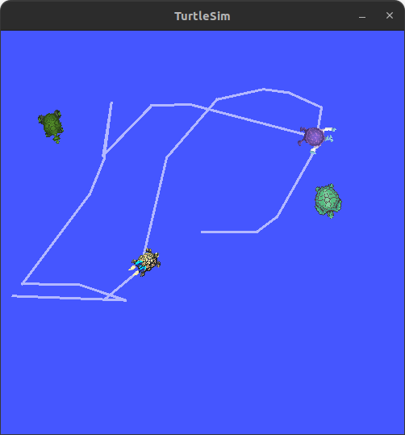

# turtleGame

turtleGame uses ros2 to simulate a chaseing game. you control a turtle and use it to chase other turtules.
 colliding into a turtle causes it to die and respawn elsewhere

 ## instructions
 after installing the packages you should be able to play the game. 
 to run turtle game first run the launch file using this command
 ```
 ros2 launch hunter_turtle_bringup demo.launch.py 
 ```

 then run the turtlesim_teleop_key command to use the ros2 builtin turtle controller
 ```
 ros2 run turtlesim turtle_teleop_key
 ```

 afterwards you should be able to run the game

 ## gameplay

 use arrow keys to control the turtle. move towards other turtles and collide with them to kill them. killed turtles respawn elsewhere


